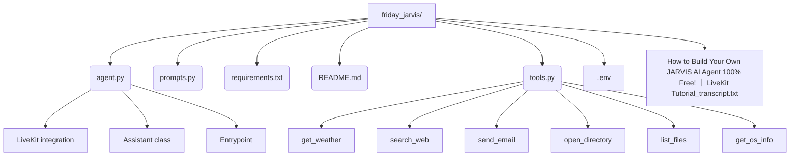

# Friday Jarvis App: Structure & Tech Overview

## File Structure

## Tech Stack
- **Python**: Main programming language
- **LiveKit**: Real-time voice/video agent platform
- **LangChain**: For web search integration (DuckDuckGo)
- **Requests**: For HTTP API calls (weather, etc.)
- **SMTP**: For sending emails
- **dotenv**: For environment variable management

## How It Works
- **agent.py**: Main entrypoint. Sets up the AI assistant, integrates with LiveKit, and registers tools.
- **prompts.py**: Contains system and session prompts to define the assistant's persona and behavior.
- **tools.py**: Houses all function tools (weather, web search, email, directory operations, OS info, etc.) that the LLM can call.
- **requirements.txt**: Lists all Python dependencies.
- **README.md**: Project overview and setup instructions.
- **.env**: Stores API keys and secrets securely.
- **Tutorial transcript**: Reference for implementation and features.

## App Flow
1. **Startup**: Loads environment, initializes assistant with persona and tools.
2. **LiveKit Session**: Handles real-time communication (voice/video/text).
3. **Tool Use**: LLM can call any registered Python function tool to perform tasks (weather, search, email, system info, etc.).
4. **Extensible**: New tools can be added as Python functions and registered for the agent to use.

---
This modular, extensible design allows Friday Jarvis to act as a powerful, voice-enabled AI assistant with access to both online and local system resources. 